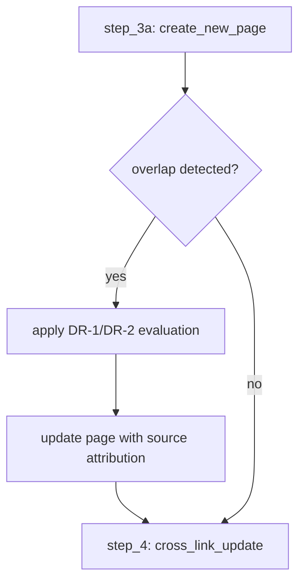

# INGEST: Text Similarity Trigger (Post-Integration Scan)

## 🎯 Цель

После создания или обновления wiki-страницы — автоматически сканировать весь wiki на overlap ≥90% с новой/обновлённой страницей. Agent получает signal и применяет DR-1/DR-2 из AGENTS.md#decision_rules.

---

## 📍 Trigger Point

**Process**: `process-ingest.json`
**Step**: После step_3b (integration_update_existing_page) или step_3a (create_new_page)
**Location**: Новый step `step_3c: post_integration_overlap_scan` — вставляется после 3b и перед step_4.

---

## 🔧 Specification

### Command Execution

```bash
# После создания/обновления страницы
./scripts/text-similarity.sh --scan-all --threshold 90 --verbose > /tmp/overlap_result.json
```

**Parameters:**
- `--scan-all`: pairwise comparison всех страниц wiki (O(n²))
- `--threshold 90`: только high-similarity matches
- `--verbose`: human-readable output на stderr, JSON на stdout

### Output Format (JSON on stdout)

```json
{
  "mode": "scan_all",
  "threshold": 90,
  "matches": [
    {
      "file1": "wiki/entities/old-page.md",
      "file2": "wiki/entities/new-page.md",
      "similarity_score": 94.7,
      "common_ngrams": 847,
      "match_level": "high_overlap"
    }
  ],
  "count": 1
}
```

### Agent Evaluation Flow

После получения JSON output:

1. **Если matches.length == 0** → proceed (no overlap detected)
2. **Если matches.length > 0**:
   - Read existing page(s) from `matches[].file1`
   - Compare with new/updated page content
   - Apply Decision Rules:
     - **DR-1**: raw overlap → neutral, no automatic penalty
     - **DR-2**: если B исправил A с evidence → B > A на corrected claim
     - **DR-3**: attribution conflict → A wins original

### Integration with Existing Flow



---

## 📋 Process-ingest.json Changes

### New Step Definition (insert after step 3b)

```json
{
  "step_id": "3c",
  "name": "post_integration_overlap_scan",
  "description": "Сканит wiki на overlap с новой/обновлённой страницей. Применяет DR-1/DR-2 из AGENTS.md#decision_rules.",
  "pre_condition": {
    "condition": "new_page_created OR page_updated",
    "trigger_after_step": "step_3b"
  },
  "actions": [
    {
      "action": "run_text_similarity_scan",
      "command": "./scripts/text-similarity.sh --scan-all --threshold 90 --verbose > /tmp/overlap_result.json",
      "output_file": "/tmp/overlap_result.json"
    },
    {
      "action": "parse_matches_from_json",
      "description": "Из JSON output извлечь matches[] → для каждого pair: similarity_score, file1, file2"
    },
    {
      "condition": "matches_count > 0",
      "note": "Agent review required — apply DR-1/DR-2 из AGENTS.md#decision_rules к каждому overlap"
    }
  ],
  "output_handling": {
    "exit_code_0": "no_overlaps — proceed to step_4 (cross_link_update)",
    "exit_code_1": "overlaps_found — report count + pairs, agent applies decision rules before proceeding"
  },
  "schema_ref": "AGENTS.md#decision_rules"
}
```

### Step Reordering

| Old Index | New Index | Name |
|-----------|-----------|------|
| step_0 | step_0 | guardrails_validation |
| step_1 | step_1 | source_analysis |
| step_2 | step_2 | discussion_with_user |
| step_3a | step_3a | integration_new_page |
| step_3b | step_3b | integration_update_existing_page |
| **step_4** | **step_3c** | **post_integration_overlap_scan** ← NEW |
| step_4 | step_5 | cross_link_update |
| step_5 | step_6 | register_source_ingested |
| step_6 | step_7 | log_registration |
| step_7 | step_7 | auto_update_index |
| step_8 | step_9 | post_operation_link_validation |

---

## 🧠 Decision Rules Application in Ingest Context

### DR-1 (Overlap Neutral)
```
Скрипт: "fileA и fileB имеют 92% overlap"
Agent: "Это raw signal. Не менять баллы автоматически."
Action: proceed, но note в page content: "Содержит текст из wiki/entities/X.md на 92%"
```

### DR-2 (Correction Evidence)
```
Script: "fileB содержит additions/deletions vs fileA"
Agent: "Если B исправил A с evidence → evaluate correction. B > A на corrected claim."
Action: добавить update section в старую страницу, отметить source и date
```

### DR-3 (Authorship Attribution)
```
Script: "fileB сообщает о факте из fileA"
Agent: "A wins original; B только reporter."
Action: добавить backlink к A в page content
```

---

## ⚠️ Caveats

1. **Performance**: `--scan-all` — O(n²) complexity. Для large wikis (>200 страниц) использовать с caution или exclude через `--exclude-dirs`.
2. **Cache**: `text-similarity.sh` кэширует результаты в `tracking/similarity_cache.json`. Интеграция с cache для избежания redundant scans.
3. **Threshold tuning**: 90% — conservative. Для early-stage wikis можно снизить до 85%.

---

## 📚 References

- **Script**: `scripts/text-similarity.sh` (Phase 11.1)
- **Process**: `process-ingest.json#step_3c`
- **Decision Rules**: `AGENTS.md#decision_rules` → DR-1, DR-2, DR-3
- **Lint Hook**: `scripts/lint.sh#check_id=9` (аналогичный trigger в lint)

---

*Created: 2026-06-27 | Author: System Architect (Wiki Schema)*
